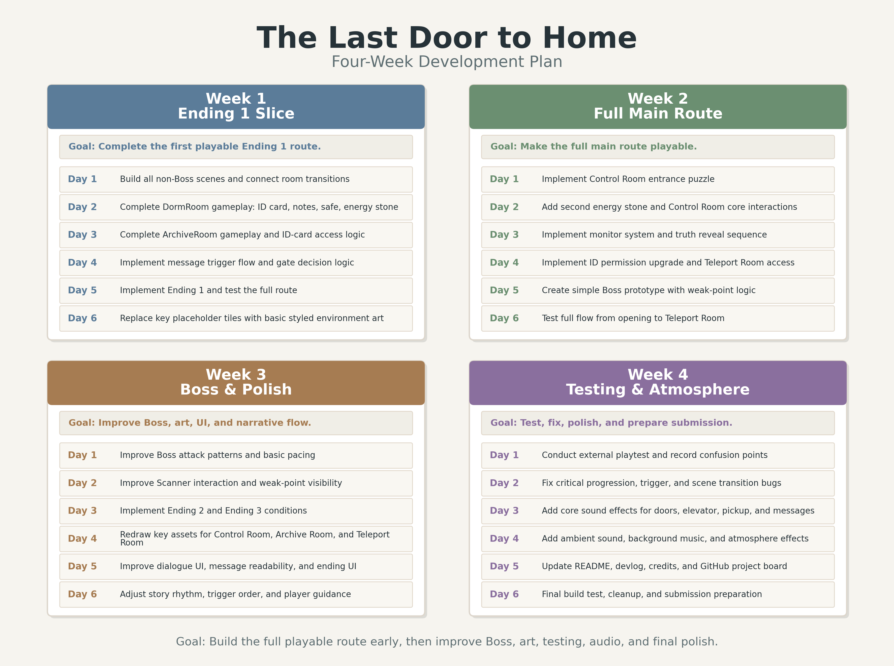

# The Last Door to Home

## 1. Module Information
**Module:** DI32002 - Games Programming  
**Project Type:** Individual coursework project  
**Engine:** Unity 2D

## 2. Project Overview
**Game Duration:** 20min (first ending), 40min (all endings).

**The Last Door to Home** is a 2D narrative puzzle game with light horror elements and branching endings.

The player takes the role of **Kian**, an astronaut and explorer who wakes up alone in a study base with fragmented memories. His last memory is standing in front of a teleportation gate with his wife and colleagues, ready to return home.

After waking up, Kian discovered that he was the only person left at the base. His goal is simple: get in touch with his wife, find out what happened, and go home. However, as he explores the base, solves puzzles, receives conflicting messages, and uncovers hidden records, he begins to realise that the truth is not as simple as imagined., and that the voice guiding him may not be trustworthy.

The game combines **room-based exploration**, **environmental storytelling**, **small puzzle interactions**, **conflicting information**, and a final **boss encounter**.

## 3. Core Idea
This project focuses on:

- **2D puzzle-based exploration**
- **interactive objects and clue collection**
- **truth-versus-falsehood information design**
- **player decisions that affect progression and endings**
- **a compact psychological horror atmosphere**
- **a small but complete playable experience**

The central design idea is that the player is not only solving puzzles, but also judging which pieces of information can be trusted.

## 4. Planned Gameplay Structure
The current plan is to build a small-scale vertical slice with:

- **a limited number of rooms**
- **environmental clues and interactive objects**
- **one or more small puzzles**
- **conflicting messages from different characters**
- **equipment choices before the final encounter**
- **a boss fight with failure conditions**
- **three possible endings**

The game is designed to stay manageable for an individual developer while still showing clear gameplay systems.

## 5. Planned Map Structure
The planned playable areas include:

1. **Dorm Room**  
   The starting area where Kian wakes up and finds the first clues.

2. **Dorm Corridor**  
   A connecting area leading to the base entrance and elevator.

3. **Base Entrance**  
   A dangerous exit point that can lead to a bad ending.

4. **Elevator and Lower Corridor**  
   A transition area leading to deeper parts of the base.

5. **Archive Room**  
   A clue-focused room containing information about the eye-flowers and the incident.

6. **Control Room**  
   A key progression area containing a puzzle, equipment choices, and surveillance records.

7. **Teleportation Room**  
   The final area where the truth is confronted through a boss encounter.

## 6. Planned Endings
### 1. Death Ending
The player trusts the wrong information, leaves the base too early, or fails during the boss encounter.

### 2. Loop / Transformation Ending
The player defeats the monster but fails to truly escape, becoming part of the cycle.

### 3. True Return Ending
The player discovers the truth, survives the final encounter, and successfully returns home with the remaining survivors.

## 7. Design Goals
The project aims to:

- create a clear gameplay loop suitable for a programming-focused coursework project
- balance narrative delivery with interactive gameplay
- keep the scope small and achievable
- use clues, contradictions, and player choices to support progression
- implement enough original game systems to support the final report
- produce a stable and playable vertical slice

## 8. Planned Game Systems
The planned systems include:

- player movement and collision
- object interaction system
- clue and message triggering
- puzzle logic
- equipment selection with gameplay consequences
- branching ending conditions
- boss encounter logic

These systems are intended to ensure that the project is not only narrative-based, but also demonstrates gameplay programming.

## 9. Development Plan

